# DFX with System View
## Table of Contents
1. [Introduction](#Introduction)
1. [Prerequisites](#prereq)
1. [Section 1: Generate the VSI Project](#generate_project)
1. [Section 2: Run the tutorial With Pregenerated Files](#run_output)
1. [Section 3: Making Changes to the System](#make_changes)
1. [Section 4: Importing Software](#import_software)


# What is Visual System Integrator?

Modern computing systems are becoming increasingly complex with multiple different computing contexts, whether it be CPUs, FPGAs, DSPs, or something new. Visual System Integrator (VSI) is a system development tool that allows for the creation of complex systems that span multiple different heterogeneous computing contexts. VSI allows for a rapid visual approach to system development, in which both infrastructure and application are described to build a complete system. The VSI tool will automatically manage communication between different contexts with use of System View**s open source driver allows for communication between CPUs and programmable logic(PL).
<a name="Introduction"></a>
# Introduction

This tutorial uses Visual System Integrator to create a heads up display that uses Dynamic Function eXchange (DFX) to reload the multiprocessor system-on-chip (MPSoC) programmable logic with different functionality on demand. The heads up display has two possible modes which are mutually exclusive. With DFX, portions of the MPSOC**s programmable logic can be reloaded while the application is running to maximize the usage of the MPSoC.

This tutorial utilizes the Ultra96 board which contains a Xilinx Ultrascale+ MPSOC chip that has a 64-bit quadcore ARM processor, dualcore ARM real-time processors, and plenty of programmable logic. A monitor connected to the HDMI output on the Ultra96 acts as a heads up display, and a keyboard and mouse connected for control.

The purpose of this tutorial is to demonstrate:

1. The VSI tool design **Flow**
2. How to import a function into VSI
3. How to use DFX in VSI
4. Run the generated files from VSI

<a name="prereq"></a>
# Prerequisites:
1. VSI install: [See get started.](https://systemviewinc.com/get-started/locally/)
2. Vivado 2018.3
3. Ultra96 V1 or V2 Board
	3.1. With a capitble USB webcam, Logictech webcams seem to work best, [this is the one we use.](https://www.amazon.com/Logitech-C920S-Webcam-Privacy-Shutter/dp/B07K95WFWM/)
	3.2. Running Linux with openCV Libraries and Video for Linux (V4L) - [get a working SD image here(4GB).](https://xdf-lab.s3.amazonaws.com/lab_sd_image_v3.img)
	3.3.(Optional) Keyboard, mouse, monitor, and USB hub to run the output application on.
4. A copy of the Linux rootfs for cross compiling
	4.1. For the SD image given above get [the rootfs here.](https://xdf-lab.s3.amazonaws.com/u96_image.tar.gz)
	4.2. Before starting VSI set env variable SYSROOT to that folder

	```
	export SYSROOT=<rootfs directory>>
	```

5. [Xilinx xfOpenCV Library](https://github.com/Xilinx/xfopencv)
	1. Before starting VSI set env variable XFOPENCV to that folder

	```
	XFOPENCV=<xfopencv directory>
	```


<a name="generate_project"></a>
# Section 1: Generate the VSI Project:

The following steps provide instructions to create a VSI project and shows the VSI tool design **Flow** used to generate and build an application. This section will also show how to use DFX in set in VSI.

1. Start **VSI**
2. Under **Quick Start**, select **Open Example Project**
The example projects are a set of platforms and applications that can be combined to quickly make different example projects. These example projects are used to create the platform for this tutorial.
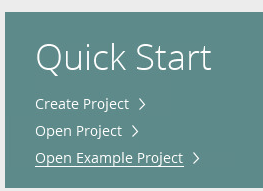
3. Under **Create an Example Project**, select Next.
4. Under **Select Project Template**, Select Next.
5. Under the **Project Name**:  
	5.1. Set the **Project name** to **vsi_dfx**
	5.2. Under the **Project location** set a location.
	5.3. If not already selected, check **Create project subdirectory**

	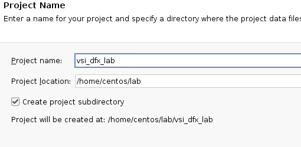

6.1. Under the **Default Part** window, select Next.
	6.1. In this example, the part is automatically set, so selecting one is not necessary.
7. Under **Configure Project**:
8. Set the platform to **ultra96_platform**
	8,1. Ultra96 is the board used for this tutorial. VSI has an example platform for this board which will be used.
	8.2. Leave the Application blank. The application will be built at a later time.

		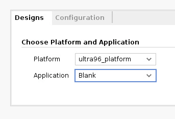

	8.3. Select Next
	8.4. Under **New Project Summary**, select Finish.

9. Open the Platform:
	9.1. From the menu bar select: **Flow** -> **Open Platform** -> **ultra96_platform_platform.bd**

	The platform is a lower level description of the infrastructure of the system. This particular platform describes the three execution contexts found on the Ultra96's ultrascale+ MPSOC chip. Execution contexts are hierarchies in which a Hardware (RTL) or a Software (C, C++, Java, etc) block can be placed for execution. The Ultra96 is comprised of two software contexts (the ARM processor and the r5 processor) and one hardware context (the programmable logic). Another important aspect of the platform is it also describes the communication between execution contexts.

	The connections between execution context show how they communicate, and represent a communicate channel between two execution contexts. In this example platform, the ARM processor (u96_ps) communicates with the programmable logic (u96_pl) using a driver and the VSI common interface. The ARM processor also communicates with the r5 processor(u96_r5) using OpenAMP. The platform canvas is the workspace provided to develop a platform for an application.

	Once the platform is completed the **Compile Platform** allows the VSI to compile the infrastructure information. The VSI design **Flow** is iterative and if the platform can be changed at anytime.

10. Compile the Platform:
	10.1. From the menu bar select: **Flow**  -> Compile Platform -> Select Ok

	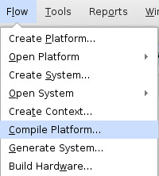

11. Create the System:
	11.1. In the tcl console on the bottom of the screen type the following command:

	```
	vsi::import_yaml_system  [current_bd_design]  <<path_to>>system_hw_pr.yaml
	```

	After creating the system the workspace is now the system canvas. The system canvas uses the same execution contexts created in the platform but the system canvas allows higher level functional blocks to be placed and connected together to describe the application.

12. After importing, a complete and functional DFX system is available. Double click on u96_pl to view what is happening in the programmable logic of the MPSoC.

	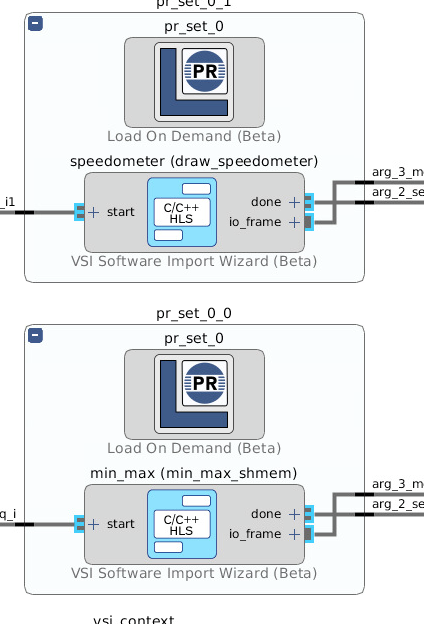

	The two hierarchies above represent the dynamic section of DFX. The blocks called min_max and speedometer are the functions that will be dynamically loaded and unloaded when needed. The exchange happens when data is sent to either of these two functions. VSI's built-in runtime keeps track of the dynamic regions and enables and disables them as needed.

	The **Load On Demand** blocks are used to configure dynamic function exchange areas. Users can set which functional blocks can be dynamically loaded and which blocks are mutually exclusive.

	The min_max block finds the brightest and darkest spots of an image and overlays an image on top. Speedometer draws a speedometer overlayed on the image. The needle position of the speedometer changes with an input control.

13. Click on the Diagram tab in the window to go back to the top. Double click on U96_ps to view the activity ARM processor.

	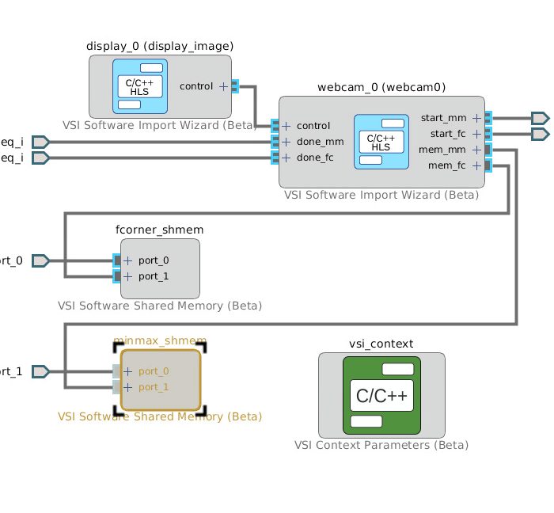

	The **webcam_0** block controls most of the functionality in the ARM processor system. The **VSI Software Shared Memory blocks** shares memory between two blocks. In this system there are two shared memory blocks. The first memory blocks is shared between webcam_0 on the processor and the min_max blocks in the PL. The second memory block is shared between webcam_0 on the processor and speedometer on the PL. The image data is passed to the MPSoC ARM processor to the programmable logic and back through a shared memory buffer, which is the ARMs DDR memory.

	**webcam_0** also outputs **start** messages and receives **done** messages from the functions on the PL. These messages act as **Flow** control between the two blocks and the start message becomes the trigger for DFX to load/unload functions.

	**display_image** captures mouse clicks and keyboard button presses and encapsulates the actions into messages for webcam_0 via the control output.

14. Generate the System:

	**Generate System** calls the VSI compiler and creates the required Vivado IPI Projects for Hardware Contexts, the required CMake based projects for Software Contexts and everything else needed for the application.

	14.1. From the menu bar select: **Flow**  -> **Generate System** -> Select **OK**

	

15. Build the High Level Synthesis Blocks (HLS):

	**Build HLS** is used to convert C/C++ code into a hardware description language and allows the code to run on the PL. This step is only required when a system has an import software block in a hardware context.

	15.1. From the menu bar select: **Flow**  -> **Build HLS** -> Select **Clean and Build**

	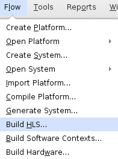

16. Generate the Software:

	Build Software Contexts will build the executable for all software context in a system.

	16.1. From the menu bar select: **Flow** -> Build Software Contexts -> Select **Clean and Build**

	

17. Generate the Hardware (Programmable logic bitstreams):

	Build Hardware will build a bitstream for each hardware context.

	17.1. From the menu bar select: ****Flow****  -> **Build Hardware**-> Select **OK**

		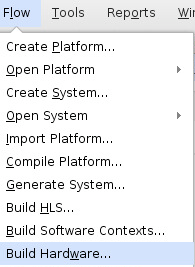

	17.2. Upon initiating the hardware build, VSI calls Vivado and builds the bistreams required for the application. This step will take a significant amount of time.

18. VSI will call Vivado in the background to create and build the Vivado project.

# Section 2: Setup environment <a name="setup_environment"></a>

The following steps provide instructions to run the application created by VSI on the Ultra96 board.

1. Navigate to the project folder directory to find all the output generated by the VSI tool.
```
	cd <<project folder directory>>
```
2. Generate .bit.bin files for FPGA Manager on the Ultra96 board

	2.1. Change directories to the folder with output bitstream files:
```
		cd vsi_auto_gen/hw/system_hw_pr/build/u96_pl/out/
```
	2.2 Convert all the bit files to .bit.bin files:
```
		for i in *.bit; do bash ../../../u96_pl_gen_bitbin.sh $i; done
```
3. Navigate the project folder directory.
```
	cd <<project folder directory>>
```
4. Copy the following files to **/home/root/dfx** on the Ultra96 board:

	+ vsi_auto_gen/hw/system_hw_pr/build/u96_pl/out/*.bit.bin
	+ vsi_auto_gen/sw/system_hw_pr/u96_ps/driver.sh
	+ vsi_auto_gen/sw/system_hw_pr/u96_ps/logrun.sh
	+ vsi_auto_gen/sw/system_hw_pr/build/u96_ps/bin/p_u96_pl_zynq_ultra_ps_e_0_init
	+ vsi_auto_gen/sw/system_hw_pr/build/u96_ps/bin/u96_ps

	```
	scp <<file>> root@<<ultra96_board>>:/home/root/dfx/
	```

# Section 3: Run the tutorial <a name="run_output"></a>
1. On the Ultra96 board start the application by running the following commands:

	```
	cd ~/dfx/
	./driver.sh
	./u96_ps
	```

2. The display should show the output of the webcam with two boxes overlaid on top. The PL on the MPSoC is drawing boxes on the lightest and darkest spots of the image.

	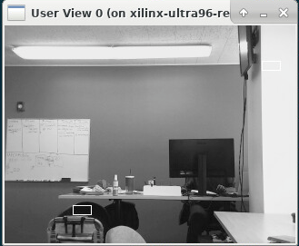

3. Click the mouse button to switch modes. The display should show the output of the webcam with a speedometer overlaid on top of it. Press the up or down arrow key on the keyboard to move the needle on the speedometer.

	

# Section 4: Making Changes to the System <a name="make_changes"></a>

The following steps provide instructions to change a function within the system, along with instructions to regenerate the output files. This section introduces settings within the Import Software Wizard block.

1. Open up the system labeled **System HW PR** and expand the u96_ps hierarchy.

	

2. This view shows all the blocks that are set to run on the ARM processor. Double click on display_0 to get to the Software Import Wizard settings. The Software Import Wizard provides access to many different settings for the software (or HLS if the block was placed in a hardware context). Currently, the system is configured to **display image**.

3. Change the system to **display image bounce**. In the **Selected Functions** area click the drop down and select **void display_images/image_bounce**.

	

4. Select **OK**.

5. Regenerate the system

	Note: The system must be regenerated when changes are made in the system.

	5.1. From the menu bar select: **Flow** -> Generate System

	

6. Rebuild the software.

	Note: The software must be rebuilt because there was a change in the software context. Hardware and HLS do not have to be rebuilt because the hardware context did not change.

	6.1. From the menu bar select: ****Flow**** -> **Build Software Contexts**

	

7. Press **q** to kill the software currently running. Run the new u96 software by running the following commands:

	```
	./driver.sh
	./u96_ps_bounce
	```

	In speedometer mode, the needle should jitter around after pressing the up or down arrow. The speedometer has some bounce that needs to be removed. The next section describes how to add user-supplied software to address the bounce issue.

# Section 5: Importing Software <a name="import_software"></a>

The following steps provide instructions to add a user-supplied software block to the system. The block added will address the speedometer bounce discovered in the last session.

1. Double click the **U96_ps** hierarchy

2. Right click somewhere on the canvas and select **Add IP...**

	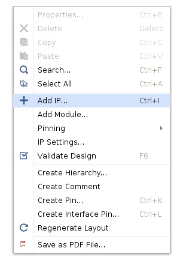

3. Select the **VSI Software Import Wizard**

	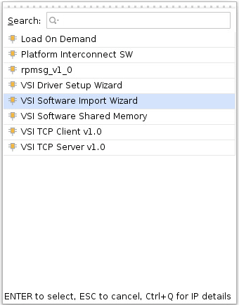

4. An unconfigured VSI Software Import Wizard Block appears. Double click on the block to configure it.

	

5. Set the Source Directory of the source code in the **Source Dir** section:

		1. Set source directory to **/opt/Systemview/VSI/target/common/hls_examples/webcam/**

		

6. In the **Selection Function** section, set the function to **void debouncer**.

	

7. Configure the Arguments as follows:

		Check **Execution Trigger** for Argument . This sets the function to run every time there is activity with this argument.

		Set the direction for Argument 2 to be **output**. This tells VSI that out is an output.

		

8. Right click the connect between **display_0** and **webcam_0** and select **Delete**

	

9. Click on the unconnected **control** port on the **display_0** block and then drag it to the **in** port on **vsi_gen_ip_0 (debounce)** to connect the control output from the display block to the input of the debouncer.

	

10. Click on the unconnected **out** port on the **vsi_gen_ip_0 (debouncer)** block and then drag it to the **control** port on **webcam_0** to connect the output of the debouncer to the input of the webcam block.

	

11. Regenerate the system.

	11.1. From the Menu bar select: **Flow**  -> **Generate System**

	

12. Rebuild the software.

	12.1. From the Menu bar select: **Flow**  -> **Build Software Contexts**

	

13. Press 'Q' to kill the software currently running. Run the new u96 software by running the following commands:

	```
	./driver.sh
	./u96_ps_debounce
	```

	In speedometer mode, the needle should no longer exhibit any jitter.

# Extra Credit: <a name="extra_credit"></a>

The sources used in this tutorial can be found at:
```
/opt/Systemview/VSI/target/common/hls_examples/webcam/
/opt/Systemview/VSI/target/common/hls_examples/images/image_algos/
```

The webcam class is defined in the **webcam.cc** and **webcam.h** files. Webcam uses Video For Linux to capture video frames from the webcam and writes the frames to a software double buffer in the function **webcam::webcam_capture_image()**. The double buffer is read by the function **webcam::webcam_cvt_process_image()** and sent to the image processing algorithm.

The image processing algorithms used in this tutorial can be found in **images/image_alogs.cc** & **images/image_alogs.h**. The function **min_max_shmem** is used to compute the minimum and maximum pixel value of an image frame and draw a box around the pixels. The function

**draw_speedometer** overlays a speedometer on the image frame. Take a look at the sources, and using the **Flow** learned in this tutorial modify the sources and create a new software application.
